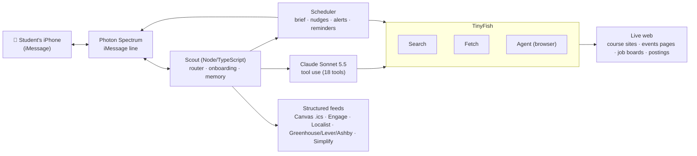

# Scout 🧭: the study copilot that lives in your texts

**Scout is an AI assistant any college student can text on iMessage.** It keeps track of your homework (from Canvas *and* your professors' own websites), finds campus events you'd actually go to, and watches for new jobs and internships in your field. It texts you first when something matters, and stays quiet when nothing does.

Built for the **TinyFish × Photon "Build Your Own AI Assistant on iMessage"** bounty.
Photon Spectrum is the messaging layer; TinyFish (Search, Fetch and Agent) is the web layer; Claude (Sonnet 5.5) is the brain.

<!-- TODO: replace with your 60-second demo video (X/LinkedIn/YouTube link or a GIF) -->
**▶ Demo video:** _coming soon_ · **🌐 Showcase site:** _add your Vercel link_

---

## The moment

It's 11pm. You have a lab due at midnight that only exists on your professor's 2004-era course site (not in Canvas), a career fair tomorrow you didn't know about, and a marketing internship that opened this morning and will fill by Friday.

You don't open five tabs. You text Scout:

> **you:** what's due this week?
> **Scout:** 3 things 👇
> • PSYC 210: ethics assignment, due Fri, Oct 23, 11:59 PM
>   https://…/calendar.html
> …
> Want these on your calendar?

And at 8am, before you've asked for anything:

> **Scout:** ☀️ Morning, Maya! Here's your day 👇
> 📚 Due in the next 48h · 🎉 On campus today (🍕 free food at 6) · 💼 New postings for you

## What Scout does

| | What you text (or don't) | What Scout does on the live web |
|---|---|---|
| 📚 **Homework** | "what's due this week?" · "done with the lab" | Reads your private Canvas calendar feed, **and crawls your professors' own course sites** (home page → Calendar / Deliverables / Syllabus pages → PDFs) to pull out real due dates. Texts you when a professor posts something new. |
| 🎉 **Campus events** | "anything with free food tonight?" | Reads events from wherever *your* school posts them: student-org platforms (Campus Labs Engage), university calendars (Localist), or any events page. |
| 💼 **Jobs & internships (any field)** | "any new marketing internships in Chicago?" | Runs a web-search watch built from what you want, checks job boards and careers pages you added, and (for tech roles) the Simplify internship list. **Opens the real posting to confirm it's still open before texting you.** |
| 📝 **Application prep** | "what does the Duolingo application ask?" | Opens the real application form in a browser and lists every question and required document. **Never fills in or submits anything.** Offers to draft essay answers you paste yourself. |
| 🗂️ **Tracker** | "I applied to Perchwell" · `apps` | Tracks saved / applied / interviewing / offer, nudges you 3 days after saving, re-checks saved postings, checks in 2 weeks after you apply. |
| ⏰ **Reminders** | "remind me at 9 to start the essay" · "snooze" | Texts you at exactly that time (even in quiet hours, since you asked). |
| 📅 **Calendar** | ❤️ an event, or "add the ethics assignment to my calendar" | Sends Google Calendar links with the event pre-filled. **You tap Save.** Nothing is added without you. |
| 🗓️ **Proactive** | (nothing) | Morning brief, due-soon nudges, "new on the course site" alerts, verified new-posting alerts, Sunday-night week plan. All deduped and silent during quiet hours. |

**Tapbacks are controls:** 👍 a reminder or due-soon nudge → marked done · ❤️ a posting → saved to your tracker · ❤️ an event or deadline → calendar link · 👎 a posting → fewer from that company · ❓ anything → Scout explains.

**Works for any school.** Onboarding (≈3 min, over text) asks your school (which sets your timezone), your Canvas feed, your courses and their websites, where your school posts events, what jobs you want, and any job boards to watch. Every step is resumable, and you can say `skip`, `back`, `restart` or `help` at any time.

## How Photon and TinyFish are used

### Photon Spectrum: the iMessage layer
- A real iMessage number: every message in and out goes through `spectrum-ts` with the `imessage` provider.
- **Proactive texts**: Scout saves each chat's space id and texts first (briefs, nudges, alerts, reminders).
- **Native iMessage features**: typing indicator while Scout works, **tapback reactions** as controls, **message effects** (🎉 confetti when your week is clear, 🎆 fireworks for an offer), rich link previews, and Scout's contact card during onboarding.

### TinyFish: the web layer (all three endpoints do real work)
| Endpoint | Where it's used | Why it's needed |
|---|---|---|
| **Search** | "find it" for a course's website or your school's events page · the **job-search watch** (recent results only) · research questions ("what's the Jane Street internship like?") | Discovering pages Scout doesn't have a URL for yet; finding postings in fields no job list covers. |
| **Fetch** | **Crawling professor course sites** (the page + its linked calendar/deliverables/syllabus pages and PDFs, batched) · events pages at schools without an API · job boards · reading any page Claude needs to answer with sources | Professor sites and small boards are messy, JS-rendered or PDF-based; Fetch returns clean markdown + links for Claude to read. |
| **Agent** | **Verifying a posting is still accepting applications** before Scout texts you · **reading real application forms** (questions, documents, deadline) · discovering deadline pages on JS-heavy course sites · job boards that only render in a real browser | Some answers need clicking through a live site the way a person would. Every Agent goal is read-only: no sign-in, no typing, no submitting. |

Already-structured feeds are read directly, because they don't need a browser: your Canvas calendar feed (.ics), Campus Labs Engage and Localist event APIs, Greenhouse/Lever/Ashby job APIs, and the Simplify list. TinyFish handles the messy web; clean data stays clean.

## Architecture



- **`src/index.ts`**: Photon Spectrum loop (messages, tapbacks, effects, attachments) + per-student queue.
- **`src/bot.ts`**: routes each text: onboarding → quick commands (`settings`, `apps`, `my week`, `brief`, `reset`) → the Claude agent.
- **`src/onboarding.ts`**: the 7-step text onboarding (a fixed state machine; Claude only parses free-form answers).
- **`src/agent.ts`**: Claude Sonnet 5.5 with 18 tools (homework, events, jobs, application prep, tracker, reminders, calendar, search/read, settings, memory).
- **`src/scheduler.ts`**: everything Scout texts on its own, in each student's timezone.
- **`src/sources/`**: Canvas, course-site crawler, events (Engage/Localist/page), jobs (Simplify/boards/search).
- **`src/tinyfish.ts`**: typed Search/Fetch/Agent client (Agent calls are never auto-retried, so a run is never billed twice).

## Trust & safety

- **Read-only on the web.** Every TinyFish Agent goal forbids signing in, typing into forms, uploading, applying or submitting. Scout can't book, buy, RSVP, apply or email anything.
- **You approve every calendar add** (tap Save) and every essay draft (Scout only drafts when you say yes).
- **Never fakes a source.** Deadlines, events and postings only come from tool results; items without a real date are dropped; web answers always carry their links (Scout appends them if the model forgets); job-search results can only link to URLs the search actually returned.
- **No passwords collected.** Canvas uses your private read-only calendar feed; login-only sites (Handshake, LinkedIn, Gradescope) are politely declined.
- **Quiet by default.** Proactive texts are deduped and suppressed during your quiet hours; the morning brief is skipped when there's nothing to say.
- **Failures are named, not hidden** ("couldn't reach the PSYC 210 site"), and the rest of the answer still comes through.
- Only numbers in `ALLOWED_PHONES` get replies. Secrets live in `.env` (gitignored); student data lives in `data/` (gitignored).

## Run it

**You need:** Node 22+, a [Photon](https://app.photon.codes) project with an iMessage line, a [TinyFish API key](https://agent.tinyfish.ai/api-keys), and an [Anthropic API key](https://console.anthropic.com).

```sh
cd tiny-fish-bounty
npm install
cp .env.example .env     # PROJECT_ID, PROJECT_SECRET, TINYFISH_API_KEY, ANTHROPIC_API_KEY, ALLOWED_PHONES
npm run dev              # starts Scout on iMessage; text your Photon number "hi"
```

No phone handy? `npm run chat` runs the exact same bot in your terminal (with `/react ❤️`, `/tick` and `/reminders` to simulate tapbacks and scheduled texts).

**Commands you can text:** `settings` · `apps` · `my week` · `brief` · `reset` · or just ask in plain English.

## Tests

```sh
npm test            # 36 offline tests: network and Claude are blocked, so they can't spend anything
npm run test:live   # free live checks: TinyFish Search + Fetch, Engage (UF), Localist (Stanford), Greenhouse, Simplify
LIVE_AGENT=1 npm run test:live   # also one TinyFish Agent run (uses credits)
npm run typecheck
```

The offline suite covers onboarding end-to-end (including resume after restart), tapback actions, calendar links, timezones, the course-site crawler, event-source detection, job matching, and proves no Claude/TinyFish request can leave the machine.

## Cost

TinyFish **Search and Fetch are free**. The **Agent** (credits) runs only when it adds real value: when you ask to check or prep a posting, before a new-posting alert (top 2 only), and when a site genuinely needs a browser. Claude costs roughly **$6–10 a month** for one active student (≈5 texts a day); pages are only re-read by Claude when their text actually changes.

## Limitations & what's next

- **Apple Calendar**: iMessage opens `.ics` attachments read-only, so Scout uses Google Calendar links for now; a hosted `https://…ics` link would enable Apple Calendar's "Add".
- **Login-only sites** (Gradescope, Handshake): possible later with TinyFish browser profiles, deliberately skipped for safety and reliability.
- **Photos & voice notes**: e.g. text a photo of a syllabus or flyer → deadlines/events.
- Runs as a single process with JSON state, fine for a demo and a handful of students, not yet for a whole campus.

---

Built by [Arya Pradhan](https://github.com/arya-pradhan) for the TinyFish Students program · Thanks to [TinyFish](https://www.tinyfish.ai) and [Photon](https://photon.codes).
